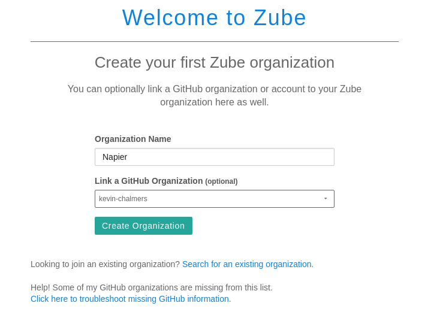

# Lab 04: Task Management and Kanban

Our next step is to extend our task management system beyond simple GitHub issues.  We will use a task board approach that comes from [Kanban](https://en.wikipedia.org/wiki/Kanban_(development)).  [Unit 4b](../../units/unit04/unit04b.md) goes into more detail about Kanban.

## Behavioural Objectives

- [ ] **Create** a *Kanban Board on Zube.*
- [ ] **Create** a *Sprint Board on Zube.*
- [ ] **Run** a *Sprint*.

## Setting up Zube.io

GitHub does support task boards - see the **Projects** tab in your repository for details.  We are going to use a different system provided by [Zube](https://zube.io/).  This is because Zube:

- Integrates with GitHub tasks.
- Provides more functionality, such as story points.

Connecting your GitHub repository is simple.  Just go to https://zube.io/ and click the **Signup with GitHub** button.


Follow the instructions to connect your account.  Once you get to the main screen you are ready to start setting up your project.

### Creating an Organisation

Next we need to create a new organisation in Zube.  An organisation is a way of managing projects.  You should see a button with **Create a new organization**.  Click this button to open the new organisation window.



Use **Napier** as the organisation name, and **ensure you link to your GitHub account name as an organisation** and click **Create Organization**.  This will open the new project window.

### Creating a Project

Next we need to create a project:


**Ensure you link the repository you are using for the labs.**  Use the same details as above and click **Create Project**.

## Organising Your Task Board

You should now see your project task board:


We are now going to go through two processes:

1. Assigning story points to our current tasks.
2. Prioritising tasks.

### Assigning Story Points

In the notes for [Unit 01b](../../units/unit01/unit01b.md) we looked at how we assign points to tasks.  It is all about estimating the size of a task against other tasks.  Zube lets us assign story points to tasks.  To do so, **Click** on a **task card** on the Kanban board.  This will open the task details window:


As you can see, there is a drop-down menu where you can set the points for a task.  To close the details of a task **click** the **cross** at the top-right of the details window.

#### Exercise

Assign points to our current tasks.  It is up-to-you to decide the scores based on your own estimate.

### Prioritising Tasks

Next we will prioritise tasks.  This is done by moving task cards up and down in the task board.  It is that simple.  Ordering tasks is the job of the **Product Owner**.  At present, the order of tasks needs to be:

- #1 Produce a report of all salaries.
- #4 Produce a report of salaries by role.
- #2 Produce a report of salaries by department (HR advisor).
- #3 Produce a report of salaries by department (department manager).
- #5 Add new employee.
- #7 Update employee details.
- #8 Delete employee details.

This is the current order tasks will be completed for the project, but it is subject to change.  Remember, we have planned, but we will keep planning.

## Setting up a Sprint Board

Now it is time to set up a *Sprint*.  Remember from [Unit 01b](../../units/unit01/unit01b.md) that a Sprint is a fixed-time where we attempt to do work.  A Sprint can have different durations, but for the labs we are going to work in a single week (as that is the amount of time to do a lab).  We define the work we are going to do and then we work on it - **not adding any new work to the sprint.**

Zube features **Sprint Boards**.  To use these, first we need to set-up a Sprint.  To do this, click on the **Sprints** menu option on the left.  This will open up the following view:


Now we need to create a new Sprint.  **Click the New Sprint button** on the top-right to open the New Sprint view:


Enter the details as shown in the image above:

- Title: Lab 04
- Description: Work on Lab 04 for SE Methods.
- Dates: As appropriate for the week you are doing this.  

**Click Save** and the Sprint will be created.  Now click on **Sprint Board** on the left-hand menu to open the Sprint Board view:


Notice that the columns to the right (Ready, In Progress, In Review, and Done) are now in the Sprint section of the Sprint Board.  This is to indicate that these columns are related to the Sprint we are going to do.  We will use these columns to manage our work during this Sprint.

## Next Feature: Salary Report

Now we are ready to start our next feature: the *Salary Report*.  To do this, we first need to create a new **Feature Branch** in our Git repository, called `feature/salary-report`.  **Do this now.**  Remember to switch to the new branch in IntelliJ.

### Starting a Sprint

Next we need to setup our Sprint Board.  The task we are going to work on (1. As an *HR advisor* I want *to produce a report on the salary of all employees* so that *I can support financial reporting of the organisation.*) must be placed in the **Ready** column of the Sprint Board.  All other tasks should be put into the **Backlog**.  Below is how your Sprint Board should look:


### Adding New Tasks

As in [Lab 03](../lab03b) our user story has a few tasks:

1. Get all current salaries from the database.
2. Print list of salaries.

We can add these tasks as new **Cards** on Zube.  This is to avoid them appearing as issues on GitHub.  To do this, **click the New Card Button** at the top-right of the Sprint Board.  This will open the **New Card Dialogue Window**:


We now need to add the details for each of the tasks above.  Enter the details for task 1 as shown:

- Only on Zube.
- 1 story point.
- Assign to yourself.
- Title: Get all current salaries from the database.
- Sprint: Lab 04.

The details for task 2 are the same but with a different title.  After both cards are added, reorder your **Ready Column** on the Sprint Board to look as follows:


We are now ready to get to work.

### Getting Salary Information

Our first task is to get all the current salaries.  First, move this card into the **In Progress Column** on Zube:


First we need to work out our SQL statement.  Examine the [database schema](https://dev.mysql.com/doc/employee/en/sakila-structure.html)


We have to *join* the `employees` and `salaries` tables.  We do this by selecting both of them with the `FROM` clause and using `WHERE` to define how we will join the tables:

```sql
SELECT ???
FROM employees, salaries
WHERE employees.emp_no = salaries.emp_no
```

We must also select only current salaries.  Remember that the database uses `9999-01-01` as an undefined date, so any current salary will have `salaries.to_date` equal to `9999-01-01`:

```sql
SELECT ???
FROM employees, salaries
WHERE employees.emp_no = salaries.emp_no AND salaries.to_date = '9999-01-01'
```

We need the following information at least:

- `emp_no`
- `first_name`
- `last_name`
- `salary`

We add that to our `SELECT` statement:

```sql
SELECT employees.emp_no, employees.first_name, employees.last_name, salaries.salary
FROM employees, salaries
WHERE employees.emp_no = salaries.emp_no AND salaries.to_date = '9999-01-01'
```

Finally, just to make life easier, we will sort on `emp_no`.  We can do this in SQL as follows:

```sql
SELECT employees.emp_no, employees.first_name, employees.last_name, salaries.salary
FROM employees, salaries
WHERE employees.emp_no = salaries.emp_no AND salaries.to_date = '9999-01-01'
ORDER BY employees.emp_no ASC
```

With our SQL statement ready, we can write the Java code to get the employees.  It is very similar to the single get employee method last week but now returns an `ArrayList` of `Employee`.  To use this type, add `java.util.ArrayList` to your `import` statements.

```java
/**
* Gets all the current employees and salaries.
* @return A list of all employees and salaries, or null if there is an error.
*/
public ArrayList<Employee> getAllSalaries()
{
    try
    {
        // Create an SQL statement
        Statement stmt = con.createStatement();
        // Create string for SQL statement
        String strSelect =
                "SELECT employees.emp_no, employees.first_name, employees.last_name, salaries.salary "
                + "FROM employees, salaries "
                + "WHERE employees.emp_no = salaries.emp_no AND salaries.to_date = '9999-01-01' "
                + "ORDER BY employees.emp_no ASC";
        // Execute SQL statement
        ResultSet rset = stmt.executeQuery(strSelect);
        // Extract employee information
        ArrayList<Employee> employees = new ArrayList<Employee>();
        while (rset.next())
        {
            Employee emp = new Employee();
            emp.emp_no = rset.getInt("employees.emp_no");
            emp.first_name = rset.getString("employees.first_name");
            emp.last_name = rset.getString("employees.last_name");
            emp.salary = rset.getInt("salaries.salary");
            employees.add(emp);
        }
        return employees;
    }
    catch (Exception e)
    {
        System.out.println(e.getMessage());
        System.out.println("Failed to get salary details");
        return null;
    }
}
```

We will do a quick update to `main` just to check everything works:

```java
public static void main(String[] args)
{
    // Create new Application
    App a = new App();

    // Connect to database
    a.connect();

    // Extract employee salary information
    ArrayList<Employee> employees = a.getAllSalaries();

    // Test the size of the returned data - should be 240124
    System.out.println(employees.size());

    // Disconnect from database
    a.disconnect();
}
```

And now we are ready to test.  Remember what we have to do:

1. Ensure **all** previous versions of `devops_app` are deleted - containers and images.
2. **Compile** the project via Maven.
3. **Package** the project via Maven.
4. **Run** the `docker-compose` file.

Hopefully, you will eventually receive the following output:

```shell
Connecting to database...
Successfully connected
240124
```

And we have completed our first task.  Go back to Zube, and click the card for the task to open it's details:


**Click Move to Done** and the task is finished.  Close the card and you will see it in the **Done** column:


Notice in the top-right we have a visual indication of how much work we have done during this Sprint.  If the card is also a *GitHub* issue this will close the issue.  You can also **drag the card** to **Done** for the same effect.

**REMEMBER** - commit your code!

### Printing Salary Information

Now to complete the second task.  **Move the card in Zube to the In Progress Column**.  Remember, we are visualising the current work being undertaken.  We must ensure our Sprint Board is kept up-to-date.

Printing the salaries just requires a new bit of Java code:

```java
/**
* Prints a list of employees.
* @param employees The list of employees to print.
*/
public void printSalaries(ArrayList<Employee> employees)
{
    // Print header
    System.out.println(String.format("%-10s %-15s %-20s %-8s", "Emp No", "First Name", "Last Name", "Salary"));
    // Loop over all employees in the list
    for (Employee emp : employees)
    {
        String emp_string =
                String.format("%-10s %-15s %-20s %-8s",
                        emp.emp_no, emp.first_name, emp.last_name, emp.salary);
        System.out.println(emp_string);
    }
}
```

We use `String.format` to put the data into columns based on the information we have from the database schema - mainly around column sizes.  If you are unfamiliar with `String.format` examine the [Java API documentation](https://docs.oracle.com/javase/7/docs/api/java/util/Formatter.html#syntax).

When run, you will get a list of all the current salaries.  The end of the list is below:

```shell
...
499977     Martial         Weisert              77858   
499979     Prasadram       Waleschkowski        54088   
499980     Gino            Usery                108364  
499981     Yunming         Mitina               63193   
499983     Uri             Juneja               52429   
499984     Kaijung         Rodham               66202   
499985     Gila            Lukaszewicz          47543   
499986     Nathan          Ranta                119906  
499987     Rimli           Dusink               56336   
499990     Khaled          Kohling              45512   
499991     Pohua           Sichman              52867   
499992     Siamak          Salverda             80389   
499993     DeForest        Mullainathan         44305  
```

And now end the task on Zube.  Either **drag the card to Done** or **open the card and Mark as Done**.  Our tasks are now complete - we just need to finalise everything.

### Committing and Cleaning Up

We are now ready to complete everything for the Sprint.  First **commit and push your work to GitHub.**  Next, we need to perform our release steps:

1. Update the version number in Maven and the Dockerfile.  You should be at `v0.1-alpha-4 (v0.1.0.4)` now.
2. Merge the feature branch into `develop`.
3. Merge `develop` into `release`.
4. Create the release - including version tag.
5. Merged `release` into `master`.
6. Merged `release` into `develop`.
7. Clean up Docker containers and images.

We can also finish our user story on Zube - **drag** or **Move to Done** the user story card.  We have now completed our Sprint work.


Finally on Zube, select **Sprints** on the left-hand menu, and **click Close on the Lab 04 Sprint*.  This will end the Sprint.

And we are done.  You have successfully completed your first lab Sprint, and used tools to support the process.

## Our Current Process

We have expanded our process at the start and the end to incorporate our Sprint methodology:

1. Decide which user story/stories to work on for the next Sprint.
2. Create a new Sprint on Zube.
3. Add the user story card(s) to the Ready column in Zube.
4. Add any additional task cards to Zube and put in priority order.
5. Pull the latest `develop` branch.
6. Start a new feature branch for the task(s) or user story.
7. Select task to work on in Zube.
8. Work on task.
9. Repeat 7-8 until feature is complete.
10. Once feature is finished, create JAR file.
11. Update and test Docker configuration with Travis.
12. Update feature branch with `develop` to ensure feature is up-to-date.
13. Check feature branch still works.
14. Merge feature branch into `develop`.
15. Repeat 5-14 until Sprint is complete.
16. Merge `develop` branch into `release` and create release.
17. Merge `release` into `master` and `develop`.
18. Close the Sprint.

This is our main process now, and although we might add a few small additions (e.g. around testing), we are in a good place for the remainder of the module.