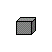

# Lecture 10: User Stories and Use Cases

In this lecture we will cover two similar yet different methods of understanding user interaction with our systems: user stories and use cases.  The first half of the lecture will focus on user stories, what they are, and how to work with them.  The second half will focus on use cases and how these are specified.

## Behavioural Objectives

- **Define** what *a user story is*.
- **Describe** the *elements of a user story*.
- **Define** what *a use case is*.
- **Specify** *a simple use case*.

## User Stories

We covered requirements in [Lecture 09](../lecture09).  A requirement represents something that our software will do to meet a business goal.  A **user story** is a definition of what our software should do for a user.  The common template is:

> As a **< user role >**, I can **< activity >** so that **< business value >**.

The parts that need to add are:

- **User role** is who the story involves.  It needs to be specific enough to allow a conversation.  *User* is not a legitimate user role.
- **Activity** is the task the user wants or is required to do.
- **Business value** is why the task is important.

For example, consider the following user story:

> As a wheelchair user I want to go into the computer lab so that I can do my assignment on a lab computer.

Consider how different the user story is just by removing one piece of information:

- I want to go into the computer lab so that I can do my assignment on a lab computer.
- As a wheelchair user I can do my assignment on a lab computer.
- As a wheelchair user I want to go into the computer lab.

- [ ] Reflect upon the information lost when parts of the information are not provided.  How could each one lead to an incorrect product being delivered?

A user story is defined using the **Three Cs formula**:

- **Card** is a physical token to hold concepts.  Physical means a member of the team can take it, it can be used in a meeting, and it can be visualised easily on the wall.
- **Conversation** between stakeholders and the team.  The story does not provide enough information for implementation, but allows a conversation to occur to discover the information.
- **Confirmation** means the objectives of the conversation have been reached.

The conversation and confirmation can occur as a story must be understandable to users, stakeholders, and developers.  It must also show value to the customer, and be of a size that developers can implement 10+ in a Sprint.

Finally, to ensure our user stories are of sufficient quality we can use the **INVEST** criteria:

- **Independent**.
- **Negotiable**.
- **Valuable**.
- **Estimable**.
- **Small**.
- **Testable**.

### User Stories versus Requirements

User stories are not requirements, but they do provide most of the same capability. They are different in that (taken from *Agile Software Requirements*):

- They are not detailed requirements specifications (something a system shall do) but are negotiable expressions of intent (it needs to do something about like this) .
- They are short, easy to read, and understandable to developers, stakeholders, and users.
- They represent small increments of valued functionality that can be developed in a period of days to weeks.
- They are relatively easy to estimate, so effort to implement the functionality can be rapidly determined.
- They are not carried in large, unwieldy documents but rather organized in lists that can be more easily arranged and rearranged as new information is discovered.
- They are not detailed at the outset of the project but are elaborated on a just-in-time basis, thereby avoiding too early specificity, delays in development, requirements inventory, and an over constrained statement of the solution
- They need little or no maintenance and can be safely discarded after implementation.
- User stories, and the code that is created quickly thereafter, serve as inputs to documentation, which is then developed incrementally as well.

### Conditions of Satisfaction

So we have user stories, and we have a *card* with the user story written on it.  This is not enough information for the development team.  Along with a general *Definition of Done*, each user story needs conditions of satisfaction, written on the back of the card.

**Conditions of Satisfaction** are questions that need to be answered for the user story to be completed to the quality required by the Product Owner.  They are the *conditions* that will *satisfy* the *Product Owner* that the story is complete.

For example, consider our previous user story:

> As a wheelchair user I want to go into the computer lab so that I can do my assignment on a lab computer.

The Conditions of Satisfaction could be:

> Is the door to the lab large enough to let in a wheelchair?
> Is the door to the lab automatic to allow the wheelchair user access?
> Is the button to open the doors at a suitable height for a wheelchair user?
> Is their space for a wheelchair user to navigate the lab freely?
> Are the desks in the lab at a suitable height for a wheelchair user?
> Is the space at each desk enough for a wheelchair user?

These are just examples, and the Conditions of Satisfaction can grow as more is understood about the story.  The point is, these are set by the Product Owner to provide more information to the team about what they want.  They are closer to a *requirement* than the user story is itself.

### Tasks

Stories can be further decomposed into tasks.  Tasks are pieces of work that can be completed by individual team members.  Tasks also lead to the completion of a user story.

Tasks are different from user stories in that they have a single owner (the person who has taken responsibility for delivering the task) and are estimated in hours rather than points.  A task should typically take a person 4-8 hours to complete.  That is, they are big enough to be a serious piece of work, but not too big to take more than a day of work.

Tasks may also be stand-alone (i.e., not explicitly part of a story).  These tasks support the team or project in some way that isn't directly about delivering stories.  For example, we may have a task related to setting up a database server.  Creating a story for this task is redundant.

### Epics

Epics represent the high-level user needs (remember our discussion on needs in [Lecutre 09](../lecture09)).  Epics can be considered big stories, but are really more about themes, programmes, or initiatives of work.

An epic has a collection of features, which are decomposed into user stories for delivery.  Epics are therefore more strategic, not specific.  The aim is to discuss features as part of an epic, with the detail flowing from this idea through user stories and finally to tasks.

### Working with User Stories

What is the basic workflow when working with user stories?  The following (taken from *Agile Software Requirements*) illustrates the basic concept:

- A member of the development team takes responsibility for a backlog item (story, task, fix, etc.).
- The item is developed to meet the teams *Definition of Done*, e.g.,:
  - Refined.
  - Designed.
  - Coded.
  - Integrated.
  - Tested.
- The item is delivered by integrating it into the build.
- Signal that the item is developed and ready for acceptance testing.
- Get the item accepted by the *Product Owner*:
  - Passes acceptance tests.
  - Meets the *Conditions of Satisfaction*.

### Working with the Product Owner

The Product Owner is key to working with user stories.  They are responsible for creating and signing-off user stories throughout the development process.  This is why the Product Owner is part of the Scrum team - the development team need access to the Product Owner to clarify what is being asked for and to check that what has been delivered meets what the Product Owner wants.

There are three stages that the Product Owner helps the development team work with user stories:

- **Definition**: the developer needs to work with the Product Owner to understand what is meant by a story.  A good rule of thumb for the Product Owner to think about here is *if you don't know how to do IT, then you don't really know what IT is*.
- **Building**: during development new topics and ideas may come out.  Again the developer and Product Owner is required to ensure story understanding evolves during development.
- **Testing**: a story must pass an acceptance test which checks that the code delivers against the story.  The Product Owner can assist by helping the developer understand the functionality of the user story, and doing some inspection of the behaviour defined.

### Story Acceptance Test

A **Story Acceptance Test** determines if a story has been implemented correctly.  A story can have one or more acceptance tests.  These tests check functionality of the system delivered.  In this way, they are different than *Conditions of Satisfaction* which require certain conditions to be met, rather than functionality implemented.

### Story-Task Relationship

We've described a number of items in this section, so let us look at how these are related.  This relationship diagram has been adapted from *Agile Software Requirements*.

- A **backlog item** is either a *epic*, *feature*, or *task*.
- An **epic** is large body of related work to be undertaken in the project.  This is realised by the delivery of one or more *features*.
- A **feature** is a particular facet of the project to be delivered.  These are realised via one of more *stories*.
- A **story** is work that is undertaken by the development team as specified by the *Product Owner*.  It has *Conditions of Satisfaction* and is done when it passes one of more *acceptance tests*.  A story can be decomposed into one or more *tasks*.

Tasks are not a backlog item as they emerge during a Sprint.  They are created and completed as part of a Sprint.  So they do exist on your Sprint/Kanban board.  They just do not exist as backlog items.

## Use Cases

The second half of the lecture focuses on use cases.  Although the name is similar, and they provide similar information, use cases are different in their aims and uses from user stories.

From [Wikipedia](https://en.wikipedia.org/wiki/Use_case)(emphasis mine):

> In software and systems engineering, a use case is **a list of actions or event steps** typically **defining the interactions between a role (known in the Unified Modeling Language (UML) as an actor) and a system to achieve a goal**.

So a use case is a *list of actions* between a *actor and system* to *achieve a goal*.  This has similar concepts to a user story:

- We have a **user**: the **actor**.
- We have what they will do: **a series of actions**.
- We have why the value: the **goal**.

A use case is more formal than a user story however, as can be seen in the definition of: *a series of actions between an actor and a system*.  User stories are not this specific.  A use case is therefore a more detailed analysis and design of what is happening in the system.

### Use Case Example

A use case has far more information than a user story.  It therefore provides more detail to the developers about what is expected in the system.  We look at a more fully-fledged use case example in [Lab 05](../../labs/lab05).  Here we will look at some of the sections:

- **Goal in Context**: *a longer statement of the goal, if needed*.
- **Scope**: *what system is considered black-box under design*.
- **Level**: *one of: Summary, Primary task, subfunction*.
- **Preconditions**: *what we expect is already the state of the world*.
- **Success End Condition**: *the state of the world upon successful completion*.
- **Failed End Condition**: *the state of the world if goal abandoned*.
- **Primary Actor**: *a role name for the primary actor, or description*.
- **Trigger**: *the action upon the system that starts the use case, may be a time event*.
- **Main Success Scenario**: *put here the steps of the scenario from trigger to goal delivery, and any cleanup after*.

There is more information we can add, and there is discussion around how much information should be used in a use case.  See the additional reading for more context.

### Cockburn's Use Case Symbols

A commonly cited text on use cases is *Writing Effective Use Cases* by Alistair Cockburn.  Many of the ideas around use cases in this module are taken from Cockburn's work.  In particular, we consider two aspects: **scope** and **goal level**.

#### Scope

*Design scope* allows us to consider what should be part of our discussions and work to deliver valuable software.  It is *very easy* to add features to software which are not required, add no value, and are therefore doing work for no point.  **As a student you should always be thinking about the scope of your work.**  You may think it best to just do everything, or not plan what you are going to do, but this just leads to wasted effort.  And remember, **waste is our biggest problem when trying to be lean.**

Cockburn suggests a simple table (taken from *Writing Effective Use Cases*):

| Topic | In    | Out    |
| ----- | ----- | ------ |
| Invoicing in any form | | Out |
| Producing reports about requests | In | |
| Merging requests into one PO | In | |
| Partial deliveries, late deliveries, wrong deliveries | In | |
| All new system services, software | In | |
| All nonsoftware parts of the system | | Out |
| Identification of any preexisting software that can be used | In | |
| Requisitions | In | |

Furthermore, Cockburn considers different levels of scope based on the level of the use case.  These are:

- **Organisation (black-box)**: the use case has organisational scope, but the internal detail is hidden.
- **Organisation (white-box)**: the use case has organisational scope and the internal detail is shown.
- **System (black-box)**: the use case has system scope, but the internal detail is hidden.
- **System (white-box)**: the use case has system scope and the internal detail is shown.
- **Component**: the use case refers to a component of the system.  This is inherently white box.

Cockburn also uses icons to represent these scopes:

| **Scope** | **Icon** |
| --------- | -------- |
| Organisation (black-box) |  |
| Organisation (white-box) |  |
| System (black-box) |  |
| System (white-box) |  |
| Component |  |

#### Goal Level

Goal level refers to where the goal is targeted.  This allows us to determine why we are doing the work and how we are going to do it.

Cockburn defines five levels:

- **Very high summary**: effectively why we are doing the work we are doing; the larger context.
- **Summary**: a particular area within the larger context.
- **User goal**: behaviour a user wants to perform.  The closest idea to a user story.
- **Subfunction**: a function that enables a user goal.  A subfunction can be part of more than one user goal.
- **Too low**: is a goal that is too low level to write a use case for.

Again, Cockburn defines some icons:

| **Goal Level** | **Icon** | **Symbol** |
| -------------- | -------- | ---------- |
| Very High Summary |  | ++ |
| Summary |  | + |
| User Goal |  | ! |
| Subfunction |  | - |
| Too Low |  | -- |

The following diagram illustrates the different goal levels of use cases:

Metrics for use cases: A survey of current proposals - Scientific Figure on ResearchGate. Available from: https://www.researchgate.net/figure/Cockburns-dimensions-of-use-cases_fig1_279404900 [accessed 4 Jan, 2019]

## Summary

We have covered quite a bit on working with user requirements in this lecture.  Our goal was to see the different levels of analysis and management we can undertake in this regard.  That is not to say user stories and use cases cannot be used together.  It is recognising how we can come closer to meeting the requirements of the user.

Specifically, we have:

- Defined what a user story is: something our software should do to satisfy a user.  We also looked at a basic user story template.
- Described the elements of a user story, including *Conditions of Satisfaction*, *acceptance test*, and *tasks*.
- Defined what a use case is: a series of actions between a user and system to achieve a goal.
- Specified a simple use case, examining features such as scope and goal level.

## Recommended Reading

*Agile Software Requirements* by Dean Leffingwell covers the ideas of stories all the way to organisational planning.

*Writing Effective Use Cases* by Alistair Cockburn has many examples of use cases written out in different levels of detail.

