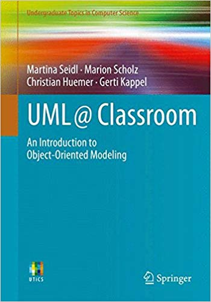

# Lecture 11: UML Diagrams

In this lecture we will examine the UML diagram types.  UML (the Unified Modelling Language) is a well-known diagramming framework for software development.  In this lecture we will cover the history and diagram types, and in [Lecture 12](../lecture12) we will examine how to use UML to analyse and design software.

## Behavioural Objectives

- [ ] **Define** *UML and its history*.
- [ ] **Describe** the *fourteen UML diagram types*.

## What is UML?

From [Wikipedia](https://en.wikipedia.org/wiki/Unified_Modeling_Language)(emphasis mine):

> The Unified Modeling Language (UML) is a **general-purpose, developmental, modeling language** in the field of software engineering, that is intended to **provide a standard way to visualize the design of a system**.

So UML is meant to:

- be general-purpose (i.e., support general software modelling).
- be developmental (i.e., enable model and system development).
- be a modelling language, which is more than just a set of diagrams.
- provide a method to visualise system design.

In this module we are mainly using UML in the last point: visualising system design.  However, UML itself can be used to develop a system where the models allow the generation of actual code.

### History of UML

The clue to UML's history is in the first part of its name: unified.  UML is actually a coming together of three different approaches to modelling object-oriented software:

- Booch method.
- Object-Modelling Technique (OMT).
- Object-Oriented Software Engineering (OOSE).

The Booch method had features such as class diagrams, object diagrams, state diagrams, sequence diagrams, component diagrams, and deployment diagrams.  In effect, the Booch method had most of the current popular UML features.  However, the Booch method was somewhat lighter on detail in these diagrams than current UML.

OMT also features class diagrams and state diagrams.  The class diagrams in OMT are more reminiscent of current UML class diagrams than the Booch method.

The main contribution of OOSE is the use-case diagram.  As users are seen as the main driving force behind what we build as software engineers, use case diagrams are seen as one of the key diagrams of UML.

By 1995, all three main diagram proponents (Grady Booch, Ivar Jacobson, and James Rumbaugh) were working at Rational Software.  This led to the creation of a UML Partners consortium in 1996, with the first UML standard proposed in 1997.

In 2005 two major events happened:

- The UML 2.0 standard was adopted.
- The International Organization for Standardization (ISO) approved an ISO standard for UML.

So UML is a standardised method and set of diagrams, but it has come from a three different sources.  This is why UML can sometimes seem a little disjointed in what it is trying to present.  One of the key things to remember is UML can be used to visualise information about the software development process.  Visualisation is one of the key aspects of DevOps - we want to be able to see what is happening.  UML can easily be generated from existing code to perform this task.

## UML Diagram Types

UML defines several types of diagram which are useful at different stages of the software development lifecycle.  The diagrams can be split into two broad types:

- **Behavioural diagrams** define what happens the *functionality* of the system.  This includes a sub-type of behavioural diagrams: 
  - **Interaction diagrams** model the flow-of-control and data in the system.
- **Structural diagrams** model the architecture and relationship between components of the system.

We will look at each one of these diagrams in turn, starting with behavioural diagrams.  The reason we start with behavioural diagrams is they feature two of the most common diagrams used to initiate design modelling: the **use case diagram** and the **activity diagram**.

## Behavioural Diagrams

Behavioural diagrams allow us to model what our system will do: the functionality.  There are seven behavioural diagram types:

- Use Case Diagrams.
- Activity Diagrams.
- State Machine Diagrams.
- Sequence Diagrams.
- Interaction Overview Diagrams.
- Timing Diagrams.
- Communication Diagrams.

Of these seven, three have popular usage: use case, activity, and sequence.  State diagrams are also popular, although state modelling in computing is normally different than UML's approach.

### Use Case Diagram

The point of a UML diagram is to capture the user's interaction with a system.  It shows the use cases defined for the system, which users (actors) interact with them, and how these use cases interact with the system.

 By Kishorekumar 62, <a href="https://creativecommons.org/licenses/by-sa/3.0" title="Creative Commons Attribution-Share Alike 3.0">CC BY-SA 3.0</a>, <a href="https://commons.wikimedia.org/w/index.php?curid=7880320">Link</a>

Use cases are often used to communicate with stakeholders as it allows developers to show how they believe a system works.  It has the system users shown, which is an important communication metaphor for non-developers.  However, it is perhaps the diagram furthest removed from actual code.

A use case diagram has three core elements:

- **Actors** who use the system, or are used by the system.  These are represented by stick figures for people and boxes for systems.
- **Use Cases** which define how the system is used.  These are represented by ovals.
- **Interactions** which show who invokes a use case, or how a use case interacts with other use cases.  These are represented by lines and arrows.

Two special types of interactions are:

- **Extends** when a use case extends upon a more generalised use case.
- **Includes** when a use case includes another for functionality.

### Activity Diagram

Activity diagrams allow us to model processes and workflows as a series of actions.  They are essentially a flowchart.  An example of a UML activity diagram is:

 By ​<a href="https://en.wikipedia.org/wiki/Main_Page" class="extiw" title="en:Main Page">spanish Wikipedia</a> user <a href="https://en.wikipedia.org/wiki/User:Gwaur" class="extiw" title="en:User:Gwaur">Gwaur</a>, <a href="http://creativecommons.org/licenses/by-sa/3.0/" title="Creative Commons Attribution-Share Alike 3.0">CC BY-SA 3.0</a>, <a href="https://commons.wikimedia.org/w/index.php?curid=4812400">Link</a>

The elements of an activity diagram are:

- **Initial node** where the workflow starts.  This is represented by a black circle.
- **Actions** where something occurs in the workflow.  Actions are represented by ellipses.
- **Decisions** where the workflow can go down different paths.  These are represented by diamonds.
- **Concurrent activity** (split and join) indicates where actions can happen at the same time or in any order.  A bar indicates the start of the activity and another bar the end.  All activities between the bars must be completed before workflow can progress.
- **Final node** where the workflow ends.  This is represented by an encircled black circle.

Arrows are used to indicate how the activity diagram should be followed.

### State Machine Diagram

State modelling in computing is a large topic in itself.  For UML, we are only concerned with object and system state, which is a little easier to manage.

An object can only be in one of a selection of states.  In a State Machine Diagram we are trying to illustrate how these states are transitioned into.  An example is:

 By <a href="//en.wikipedia.org/w/index.php?title=User:Mirosamek&amp;action=edit&amp;redlink=1" class="new" title="User:Mirosamek (page does not exist)">Mirosamek</a> (<a href="//en.wikipedia.org/wiki/User_talk:Mirosamek" title="User talk:Mirosamek">talk</a>) - I (<a href="//en.wikipedia.org/w/index.php?title=User:Mirosamek&amp;action=edit&amp;redlink=1" class="new" title="User:Mirosamek (page does not exist)">Mirosamek</a> (<a href="//en.wikipedia.org/wiki/User_talk:Mirosamek" title="User talk:Mirosamek">talk</a>)) created this work entirely by myself., <a href="https://creativecommons.org/licenses/by-sa/3.0/" title="Creative Commons Attribution-ShareAlike 3.0">CC BY-SA 3.0</a>, <a href="https://en.wikipedia.org/w/index.php?curid=23947431">Link</a>

State machines look similar to activity diagrams, but rather than model a process or workflow we are modelling how an object changes state during system execution.  We have a starting state (indicated by an initial transition), other states, state transitions (indicated by arrows), and possibly an end state.

### Interaction Diagrams

Interaction diagrams try and model how components interact during system execution.  This is a sub-type of behaviour featuring the following four diagrams:

- Sequence Diagrams.
- Interaction Overview Diagrams.
- Timing Diagrams.
- Communication Diagrams.

Of these four, only sequence diagrams see common usage.

#### Sequence Diagram

Sequence diagrams visualise how objects interact over time during method calls.  They allow us to see the flow of interactions between objects, which enables us to determine side-effects when we make a method call.  An example diagram is:

 By Coupling_loss_graph.svg - File:CheckEmail.png, <a href="https://creativecommons.org/licenses/by-sa/3.0" title="Creative Commons Attribution-Share Alike 3.0">CC BY-SA 3.0</a>, <a href="https://commons.wikimedia.org/w/index.php?curid=20544977">Link</a>

At the top of the diagram the objects that form the interaction are shown.  Each has a timeline of activity when they are active.  For example, during the `checkEmail` call above, the `Computer` is active during the entire call.  The `Server` is only active during invoked activities.

Arrows indicate the subsequent method calls between the objects.  Responses are sent back as dotted line arrows.

#### Interaction Overview Diagram

In simple terms, an interaction overview diagram is like an activity diagram but where an activity node contains another interaction diagram.  For example:

 By <a href="//commons.wikimedia.org/w/index.php?title=User:Stkl&amp;action=edit&amp;redlink=1" class="new" title="User:Stkl (page does not exist)">Stkl</a> - Own work, translation from German version <a href="//commons.wikimedia.org/wiki/File:Uml-Iod-Diagramm1.svg" title="File:Uml-Iod-Diagramm1.svg">Uml-Iod-Diagramm1.svg</a>, <a href="https://creativecommons.org/licenses/by-sa/4.0" title="Creative Commons Attribution-Share Alike 4.0">CC BY-SA 4.0</a>, <a href="https://commons.wikimedia.org/w/index.php?curid=39314758">Link</a>

The aim here is to reduce the complexity of a diagram by allowing nested diagrams.  This means we can visualise high-level workflow behaviour in an easier manner.  This is useful if your system is complex, otherwise the interaction overview diagram serves no additional purpose than an activity diagram.

#### Timing Diagram

A timing diagram is similar to a sequence diagram but with time now being the main access.  An example is:

Taken from *Timing Diagrams* https://www.uml-diagrams.org/timing-diagrams.html.

Here we see how different objects change state and interact over time.  We also add some time constraints.  If timing performance is important to your project then the timing diagram may be useful.

#### Communication Diagram

The communication diagram illustrates similar information to the class, sequence, and use case diagrams arranged in a different form.  For example:

 By <a href="//commons.wikimedia.org/w/index.php?title=User:Oemmler&amp;action=edit&amp;redlink=1" class="new" title="User:Oemmler (page does not exist)">Oemmler</a> - Omnigraffle Modeling tool
Previously published: no, no other publication of that work, <a href="https://creativecommons.org/licenses/by-sa/3.0" title="Creative Commons Attribution-Share Alike 3.0">CC BY-SA 3.0</a>, <a href="https://commons.wikimedia.org/w/index.php?curid=33160128">Link</a>

The point of a communication diagram is to illustrate the same information as a sequence diagram but in a different form.  This allows a different view of the information which may enable easier finding of problems.

## Structural Diagrams

Structural diagrams are about how the application looks from an architectural point of view.  This is more about the application looks from a code point of view than how it runs.  There are seven types of structural diagram:

- Class Diagrams.
- Object Diagrams.
- Component Diagrams.
- Composite Structure Diagrams.
- Deployment Diagrams.
- Package Diagrams.
- Profile Diagrams.

### Class Diagram

Class diagrams are perhaps the most common UML diagram type seen.  They visualise most of the information contained in our source code.  An example class diagram is:

 By No machine-readable author provided. <a href="//commons.wikimedia.org/w/index.php?title=User:Noodlez84&amp;action=edit&amp;redlink=1" class="new" title="User:Noodlez84 (page does not exist)">Noodlez84</a> assumed (based on copyright claims). - No machine-readable source provided. Own work assumed (based on copyright claims)., Public Domain, <a href="https://commons.wikimedia.org/w/index.php?curid=659677">Link</a>

Classes are represented by boxes with the following information layers:

- Top layer: the *name* of the class.
- Middle layer: the *properties or attributes* of the class.
- Bottom layer: the *methods* of the class.

Attributes and methods are the key pieces of information for an individual class.  There information provided includes:

- The **visibility** of the attribute or method:
  - `+` means `public`.
  - `-` means `private`.
  - `#` means `protected`.
  - `~` means package level visibility.
- The **name** of the attribute or method.
- The **parameters** (names and types) for method calls.
- The **type** of the attribute or method.

All this information is contained within your code so it is easy to create a class diagram from an existing set of code.  We do this in [Lab 06](../../labs/lab06).  The other information contained in your code is the relationships between objects:

 By Yanpas - <a class="external free" href="https://commons.wikimedia.org/wiki/File:Uml_classes_en.svg">https://commons.wikimedia.org/wiki/File:Uml_classes_en.svg</a>, <a href="https://creativecommons.org/licenses/by-sa/4.0" title="Creative Commons Attribution-Share Alike 4.0">CC BY-SA 4.0</a>, <a href="https://commons.wikimedia.org/w/index.php?curid=63418088">Link</a>

- *association* is the most generic relationship type.
- *inheritance* means that a class is a specialisation of another class.
- *realization/implementation* is when a class implements an *interface*.
- *dependency* is a special form of association where changes to a class means the dependant class will likely have to change.
- *aggregation* is a special form of association denoting a *has-a* relationship.  This is not considered a strong relationship in so far as the class does not own the associated object.
- *composition* is as aggregation but now the class **owns** the object.  When an instance of the owning object is destroyed so are its components.

We won't discuss association any further as this is the most generic relationship type.  It means that there is some form of relationship between the two classes.  The more likely relationship is a dependency.  This is where one class uses another, and therefore any changes to the used class will likely require changes to the using class.

Aggregation and composition are similar relationships that illustrate that an instance of a class is an attribute of another class.  The difference is in the ownership.  Aggregation means that the attribute object is shared between multiple other objects.  The composition relationship means that the object owns its attribute instance, and when it is destroyed so is the other object.

Aggregation and composition can also have multiplicity.  This is when a number is placed on the ends of the arrows to indicate is 1, 0..1, 1..&ast;, 0..&ast;, etc. depending on how many of a given object is contained.  The name of the relationship (i.e., attribute name) may also be provided.  The following diagram illustrates a couple of different uses of aggregation and composition:

 By <a href="https://en.wikipedia.org/wiki/User:ACiD2" class="extiw" title="en:User:ACiD2">ACiD2</a>, <a href="https://en.wikipedia.org/wiki/User:Mikm" class="extiw" title="en:User:Mikm">Mikm</a>, <a href="https://en.wikipedia.org/wiki/User:Pne" class="extiw" title="en:User:Pne">Pne</a>, <a href="https://en.wikipedia.org/wiki/User:Mjchonoles" class="extiw" title="en:User:Mjchonoles">Mjchonoles</a>, <a href="https://en.wikipedia.org/wiki/User:Rjgodoy" class="extiw" title="en:User:Rjgodoy">Rjgodoy</a> - Own work, Public Domain, <a href="https://commons.wikimedia.org/w/index.php?curid=54320206">Link</a>

Inheritance and implementation relates to whether one class *implements* or *extends* from a parent class.  Interfaces and abstract classes require implementations, whereas any class can be used in inheritance.

Relationships are perhaps the most difficult aspect of object-orientation for new students.  Using diagrams does enable a better understanding, if you understand what all the different relationship types mean.

### Object Diagram

Object diagrams model objects at a specific point in the execution of the software.  These are object instances rather than classes.  Object diagrams are not commonly used; normally only for data structures.

 By Mac9 - Own work, Public Domain, <a href="https://commons.wikimedia.org/w/index.php?curid=4728433">Link</a>

### Component Diagram

Component diagrams allow us to visualise how different software components (e.g., executables, libraries) work together.  This can be useful if you want to see dependencies between such components, but of limited use otherwise.

 By <a href="//commons.wikimedia.org/w/index.php?title=User:Kishorekumar_62&amp;action=edit&amp;redlink=1" class="new" title="User:Kishorekumar 62 (page does not exist)">Kishorekumar 62</a> - Own work, <a href="http://creativecommons.org/licenses/by-sa/3.0/" title="Creative Commons Attribution-Share Alike 3.0">CC BY-SA 3.0</a>, <a href="https://commons.wikimedia.org/w/index.php?curid=5766927">Link</a>

### Composite Structure Diagram

Composite structure diagrams are like component diagrams but take a class and class attribute point of view.  This is a very low level which has limited use.

 By [:w:User:KenSWebb|User:KenSWebb] - English Wikipedia <a href="https://en.wikipedia.org/wiki/en:Image:CompositeStructureDiagram.png" class="extiw" title="w:en:Image:CompositeStructureDiagram.png">here</a>, Public Domain, <a href="https://commons.wikimedia.org/w/index.php?curid=4465341">Link</a>

### Deployment Diagram

Deployment diagrams also examine software components and their relationships, but also include hardware nodes where these components run.  This can be useful if you have a complex configuration to manage.

 By <a href="//commons.wikimedia.org/w/index.php?title=User:Kishorekumar_62&amp;action=edit&amp;redlink=1" class="new" title="User:Kishorekumar 62 (page does not exist)">Kishorekumar 62</a> - Own work, <a href="http://creativecommons.org/licenses/by-sa/3.0/" title="Creative Commons Attribution-Share Alike 3.0">CC BY-SA 3.0</a>, <a href="https://commons.wikimedia.org/w/index.php?curid=5774074">Link</a>

### Package Diagram

Package diagrams illustrate how different packages interact.  This can be useful if you want to see which packages in your library/application rely on each other.  If this information isn't useful neither is the package diagram.

 By <a href="//commons.wikimedia.org/w/index.php?title=User:Kishorekumar_62&amp;action=edit&amp;redlink=1" class="new" title="User:Kishorekumar 62 (page does not exist)">Kishorekumar 62</a> - Own work, <a href="https://creativecommons.org/licenses/by-sa/3.0" title="Creative Commons Attribution-Share Alike 3.0">CC BY-SA 3.0</a>, <a href="https://commons.wikimedia.org/w/index.php?curid=5803376">Link</a>

### Profile Diagram

Profile diagrams are well outside the scope of this module.  These diagrams are about extending the existing UML notation.

 By Gubaer - Own work (Original text: selbst gezeichnet), <a href="http://www.gnu.org/copyleft/fdl.html" title="GNU Free Documentation License">GFDL</a>, <a href="https://commons.wikimedia.org/w/index.php?curid=23788088">Link</a>

## Summary

This lecture has mainly been information based without much context.  The [next lecture](../lecture12) provides a useful look at UML.  Here we have:

- [ ] *Defined UML and its history*, especially around why it is a unified modelling approach.
- [ ] *Described the fourteen UML models*, dividing these into behavioural and structural types.

## Recommended Reading

There are quite a few UML books available, each with their strengths and weaknesses.  One that currently has good reviews is *UML @ Classroom*:

