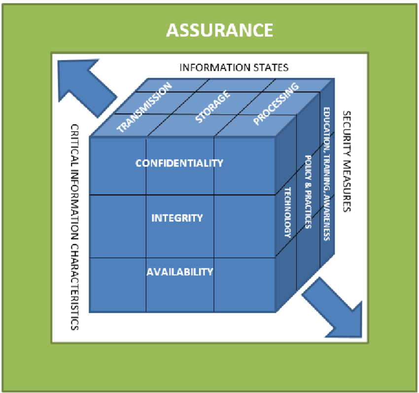
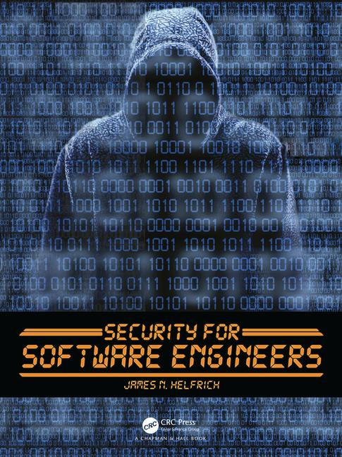

# Lecture 23: Computer Security

In this lecture we will focus on security concerns.  Computer security is an important topic in computing, and as professional software engineers you have a duty to ensure the safety of users in the systems you build.  Security is a large topic, and this is really just an introduction to the topic.

## Behavioural Objectives

- [ ] **Define** the *roles in computer security.*
- [ ] **Describe** the *ethics of white hats.*
- [ ] **Define** the *terms in the McCumber Cube.*
- [ ] **Describe** *computer security attacks and related terminology.*

## What is Computer Security?

From [Wikipedia](https://en.wikipedia.org/wiki/Computer_security):

> Computer security, cybersecurity or information technology security (IT security) is the protection of computer systems from theft or damage to their hardware, software or electronic data, as well as from disruption or misdirection of the services they provide.

A better definition comes from *Security for Software Engineers* by James Helfrich:

> Computer security can be defined as providing confidentiality, integrity, and availability (C.I.A.) assurances to users or clients of information systems.

We will define confidentiality, integrity, and availability later in the lecture.  Let us first define the actors in the computer security story.

## Roles

There are two roles in computer security: users and hackers.

### Users

Users of IT systems are the victims of computer security attacks.  Therefore, our role is to defend users against such attacks.  Thus, we define computer security in terms of the user's needs, and not in terms of the attacker or technology.

### Hackers

In general, two types of hacker exist, black hats and white hats.

#### Black Hats

Black hats are people who attempt to break system security without permission.  Three generations of black hats exist:

- Curiosity and pride motivate first-generation black hats.
- Financial gain motivates second-generation black hats.
- Ethical, moral, or political reasons motivate third-generation black hats.

Financial gain is possible for black hats.  Spam, fraud, ransomware, theft, and phising are such techniques.  Due to the relative safety of electronic crime, the broad target audience, and potential monetary gain, many see black hat crimes as an attractive proposition.

A form of first generation black hat is the grey hat.  These hackers find vulnerabilities and report them to improve system security.

#### White Hats

White hats are the good guys in computer security.  The role of a white hat may be varied, but they share two principles:

- Ethics: which we covered last week and will cover again in this lecture.
- Defence: white hats defend users.

Therefore, white hats uphold the law by providing a defence to users.  All IT professionals should act as white hats, but there are specific duties for software engineers.

##### Software Engineers

Software engineers must write code resistant to attacks.  Therefore, as a software engineer, we need to familiarise ourselves with security issues and plan how to minimise vulnerabilities.  We never know when our code will be involved in a critical security event, and thus we must practice these ideas at all stages of the software development process.

Given our definition of computer security:

> Computer security can be defined as providing confidentiality, integrity, and availability (C.I.A.) assurances to users or clients of information systems.

A software engineer has to engineer software so confidentiality, integrity, and availability are assured.  Thus, a software engineer must perform the following activities:

- Write code that lacks vulnerabilities.
- Locate and fix vulnerabilities in an existing codebase.
- Integrate security features - such as authentication or encryption - into code.

## Ethics

We mentioned ethics as underpinning the work of white hats.  We often refer to computer security as cyber warfare, and it is interesting to note ethics in warfare.  Although ethics in war are today well established, this was not always the case.  Some IT professionals argue that to combat security threats might require unethical means.  Our definitions of IT professionals include ethics and codes of conduct, so we should incorporate this thinking into our computer security approach.

White hats generally agree on the ethics published by (ISC)<sup>2</sup>.  To provide a counterpoint, we will also present the Hacker's Manifesto.

### (ISC)<sup>2</sup> Code of Ethics

The International Information System Security Certification Consortium (ISC)<sup>2</sup> provides training and certification in computer security.  They also have a defined code of ethics adopted by white hats.  The (ISC)<sup>2</sup> Code of Ethics is similar to the ACM Code of Ethics and the BCS Code of Conduct, albeit focused on being lawful and protecting others.  The fundamental principles of the (ISC)<sup>2</sup> Code of Ethics are:

- Protect: white hats have a responsibility to:
  - Protect society from threats.
  - Protect computer systems from attacks.
  - Teach people how to protect against attacks.
- Act honourably: white hats must be honest and inform employers what they are doing.
- Provide service: white hats should give advice and treat everyone fairly.
- Advance the profession: white hats should respect the authority given to them and only work in their areas of competence.  Avoiding conflicts of interest is essential.

The full (ISC)<sup>2</sup> Code of Ethics is:

- Protect society, the common good, necessary public trust and confidence, and the infrastructure.
  - Promote and preserve public trust and confidence in information and systems.
  - Promote the understanding and acceptance of prudent information security measures.
  - Preserve and strengthen the integrity of the public infrastructure.
  - Discourage unsafe practice.
- Act honorably, honestly, justly, responsibly, and legally.
  - Tell the truth; make all stakeholders aware of your actions on a timely basis.
  - Observe all contracts and agreements, express or implied.
  - Treat all members fairly.  In resolving conflicts, consider public safety and duties to principals, individuals, and the profession in that order.
  - Give prudent advice; avoid raising unnecessary alarm or giving unwarranted comfort.  Take care to be truthful, objective, cautious, and within your competence.
  - When resolving differing laws in different jurisdictions, give preference to the laws of the jurisdiction in which you render your service.
- Provide diligent and competent service to principals.
  - Preserve the value of their systems, applications, and information.
  - Respect their trust and privileges that they grant you.
  - Avoid conflicts of interest or the appearance thereof.
  - Render only those services for which you are fully competent and qualified.
- Advance and protect the profession.
  - Sponsor for professional advancement those best qualified.  All other things equal, prefer those who are certified and who adhere to these canons.  Avoid professional association with those whose practices or reputation might diminish the profession.
  - Take care not to injure the reputation of other professionals through malice or indifference.
  - Maintain your competence; keep your skills and knowledge current.  Give generously of your time and knowledge in training others.

### Hacker's Manifesto

To provide the black hats view, consider the Hacker's Manifesto (taken from http://phrack.org/issues/7/3.html#article):

```
=-=-=-=-=-=-=-=-=-=-=-=-=-=-=-=-=-=-=-=-=-=-=-=-=-=-=-=-=-=-=-=-=-=-=-=-=-=-=-=
The following was written shortly after my arrest...

                       \/\The Conscience of a Hacker/\/

                                      by

                               +++The Mentor+++

                          Written on January 8, 1986
=-=-=-=-=-=-=-=-=-=-=-=-=-=-=-=-=-=-=-=-=-=-=-=-=-=-=-=-=-=-=-=-=-=-=-=-=-=-=-=

        Another one got caught today, it's all over the papers.  "Teenager
Arrested in Computer Crime Scandal", "Hacker Arrested after Bank Tampering"...
        Damn kids.  They're all alike.

        But did you, in your three-piece psychology and 1950's technobrain,
ever take a look behind the eyes of the hacker?  Did you ever wonder what
made him tick, what forces shaped him, what may have molded him?
        I am a hacker, enter my world...
        Mine is a world that begins with school... I'm smarter than most of
the other kids, this crap they teach us bores me...
        Damn underachiever.  They're all alike.

        I'm in junior high or high school.  I've listened to teachers explain
for the fifteenth time how to reduce a fraction.  I understand it.  "No, Ms.
Smith, I didn't show my work.  I did it in my head..."
        Damn kid.  Probably copied it.  They're all alike.

        I made a discovery today.  I found a computer.  Wait a second, this is
cool.  It does what I want it to.  If it makes a mistake, it's because I
screwed it up.  Not because it doesn't like me...
                Or feels threatened by me...
                Or thinks I'm a smart ass...
                Or doesn't like teaching and shouldn't be here...
        Damn kid.  All he does is play games.  They're all alike.

        And then it happened... a door opened to a world... rushing through
the phone line like heroin through an addict's veins, an electronic pulse is
sent out, a refuge from the day-to-day incompetencies is sought... a board is
found.
        "This is it... this is where I belong..."
        I know everyone here... even if I've never met them, never talked to
them, may never hear from them again... I know you all...
        Damn kid.  Tying up the phone line again.  They're all alike...

        You bet your ass we're all alike... we've been spoon-fed baby food at
school when we hungered for steak... the bits of meat that you did let slip
through were pre-chewed and tasteless.  We've been dominated by sadists, or
ignored by the apathetic.  The few that had something to teach found us will-
ing pupils, but those few are like drops of water in the desert.

        This is our world now... the world of the electron and the switch, the
beauty of the baud.  We make use of a service already existing without paying
for what could be dirt-cheap if it wasn't run by profiteering gluttons, and
you call us criminals.  We explore... and you call us criminals.  We seek
after knowledge... and you call us criminals.  We exist without skin color,
without nationality, without religious bias... and you call us criminals.
You build atomic bombs, you wage wars, you murder, cheat, and lie to us
and try to make us believe it's for our own good, yet we're the criminals.

        Yes, I am a criminal.  My crime is that of curiosity.  My crime is
that of judging people by what they say and think, not what they look like.
My crime is that of outsmarting you, something that you will never forgive me
for.

        I am a hacker, and this is my manifesto.  You may stop this individual,
but you can't stop us all... after all, we're all alike.

                               +++The Mentor+++
```

## McCumber Cube

With some background in place, we can define the technical terminology of computer security.  A common model is the McCumber Cube:



- CIA stands for Confidentiality, Integrity, and Availability.  We will examine these next.
- Asset state refers to where information is when an attacker exploits it.  We will also examine asset state soon.
- Safeguards are how we protect against attacks.

Safeguards are split into three categories:

- Policy and practices: the controls an organisation puts in to ensure people mitigate risks.
- Human factors: the training provided by an organisation to avoid risks such as viruses and social engineering tactics.
- Technology: the software and hardware solutions used to protect systems.

We will not go into safeguards any further as we would require entire lectures to cover some of these ideas.

### Confidentiality, Integrity, and Availability

Remember, computer security is about maintaining confidentiality, integrity, and availability.  Each of these features ensures we provide a high-quality, safe service to our users.

Confidentiality is the assurance that our systems keep user's data private.  When a black hat targets confidentiality it is known as a disclosure attack.  This attack occurs when an attacker exposes private data against the owner's wishes.

Integrity is the assurance that a system preserves data.  Alteration attacks target integrity, changing or destroying data, so it becomes invalid.

Availability is the assurance that users can access resources.  To target availability is to perform a denial attack.  When a user requests a resource and cannot, the attacker has denied them access.

We will examine the attacks on confidentiality, integrity, and availability in the next section.

### Asset State

The second dimension of the McCumber Cube is the state of an information asset.  Most problems focus on one or two states, but it is common for a problem to cover all three.

Storage is Data at Rest.  Data in a hard drive, memory, or an external device (e.g., SD card) is at rest.  Stored data usually is easiest to protect (for example, via encryption) but is usually the most valuable.

Transmission is when a system moves data from one location to another.  Network security targets this state.

The processing state occurs when data is in use.  Most vulnerabilities occur in this state as a program is working on the data and is therefore open to modification and access.

## Attacks

To write secure code requires an understanding of how black hats exploit vulnerabilities.  These exploits are known as attacks.  Let us define some terminology:

- Asset: something of value that a defender wishes to protect, e.g., passwords, bandwidth, CPU use, reputation, or simple credit card information.
- Threat: a potential event causing an asset to lose value or an attacker taking possession of the data, e.g., transfer of ownership, destruction, disclosure, or corruption.
- Vulnerability: a weakness in a system allowing a threat to occur.  A white hat's role is to minimise vulnerabilities.
- Risk: a vulnerability paired with a threat, meaning a comprise exists with insufficient protection leading to a possible attack.
- Attack: a realised risk when an attacker performs an exploit.
- Mitigation: the process of reducing risks be either reducing vulnerabilities or devaluing assets.

### Attack Vector

An attack vector is a path an attacker takes to access an asset.  An attack vector can include multiple vulnerabilities and assets.  The attacker is attempting any method to access the asset and therefore using multiple approaches improves the probability of success.

As a software engineer, we concern ourselves with understanding attack vectors.  Attack vectors help illustrate the vulnerabilities that lead to an attacker compromising an asset.  Let us consider an example, adapted from Security for Software Engineers:

- Scenario: a malicious student wishes to change their grade on the records system.
- Asset: the grade.
- Threat: damage the integrity of the grade by altering it.
- Vulnerability: for example, an administrator could have an unsafe password written on a piece of paper.
- Risk: the student obtains the password, logs in as the administrator, and changes the grade.
- Mitigation: a policy that no passwords are written down.

### Threat Modelling

Threats are our starting point when considering our risks and how to mitigate them.  Threat modelling is the process of analysing a system for vulnerabilities.  It is best to do this during system specification and design rather than retrofitting later.

As Agile practitioners, we should add user stories, conditions of satisfaction, tests, and other features to our work.  We can also dedicate Sprints to improving our security via producing threat models taken from understanding our attack vectors and building further mitigations.

### Disclosure, Alteration, and Denial

Remember that confidentiality, integrity and availability assurances are our goals.  Attacks on CIA are known as DAD: Disclosure, Alteration, and Denial.

- Disclosure attacks are attacks on confidentiality.  If an asset is viewed contrary to the wish of the owner, then a confidentiality breach or disclosure attach has occurred.
- Alteration attacks are attacks on integrity.  When an attacker makes unauthorised changes to a user's data, they have compromised system integrity and performed an alteration attack.
- Denial attacks are attacks on availability.  Denial of service attacks disrupts the user's access to systems, impacting the availability of that system.

### STRIDE

STRIDE is another acronym to remember.  It defines six categories of threats:

#### Spoofing

Identity spoofing is pretending to be someone else, such as using another person's login details.

#### Tampering

Tampering involves changing data in some manner such as deleting or modifying data.  Examples include:

- Intercepting a transmission and modifying it before sending to the recipient.
- Modifying a program so malicious code is executed each time we use the program.
- Modifying a web page without authorisation.

#### Repudiation

Repudiation is disavowing an action or put simply hiding your tracks.  Modifying logs to hide that a system was accessed is one such example.  Repudiation is a particular form of tampering attack.

#### Information Disclosure

Information disclosure is the exposure of a user's confidential data against their wishes.  These attacks are often well documented, such as the release of credit card numbers.

#### Denial of Service

Denial of Service (DoS) attacks target service availability.  Again, these attacks are often well publicised.  Examples include:

- Holding a public protest at a university so classes cannot occur.
- Setting off a fire alarm to stop an exam.
- Interrupting a power supply to stop a device being used.
- Flooding a web server with requests to consume CPU usage and deny other users access.
- Changing a user's password so they cannot access a system.

#### Elevation of Privilege

Elevation of privilege is finding a method of performing tasks the attacker is not authorised to do.  Doing so enables other types of attacks.  The attacker is not spoofing but is changing their rights of access.  Examples include:

- Buffer overrun attacks.
- Account modification to increase privileges.

## Summary

As stated, we have only really introduced the concepts of computer security, and your role is to continue your development in this area to ensure the systems you build are secure.  Specifically, this lecture has:

- Defined the roles in computer security, looking at users, black hats, and white hats.
- Described the ethics of white hats, presenting the (ISC)<sup>2</sup> Code of Ethics.
- Defined the terms in the McCumber Cube including CIA, asset state, and safeguards.
- Described computer security attacks and related terminology, such as STRIDE.

## Recommended Reading

*Security for Software Engineers* by James Helfrich provides further depth to the areas we have covered in this lecture.

